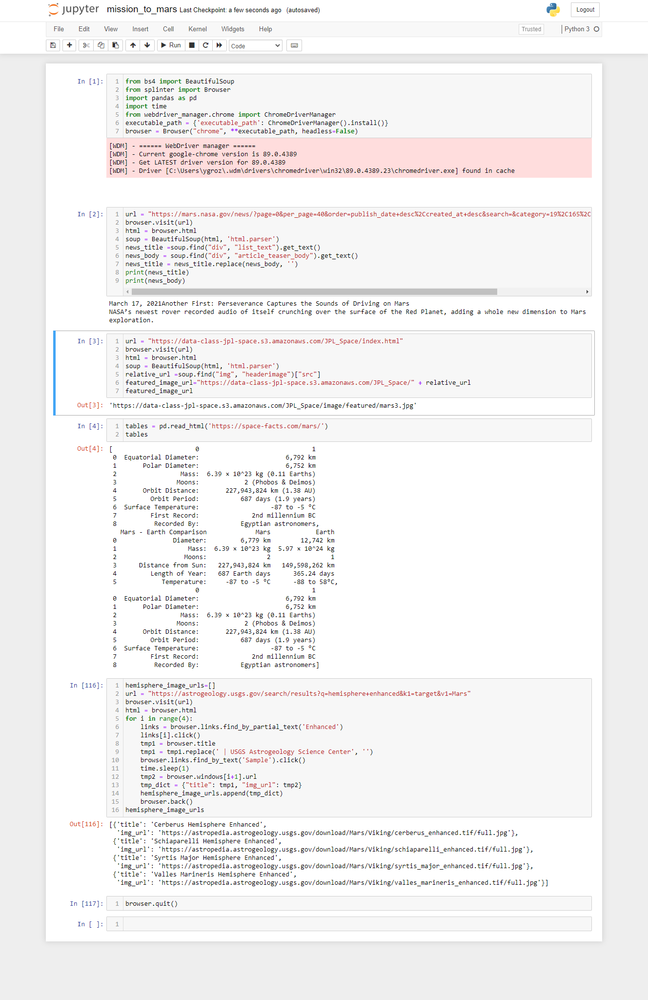
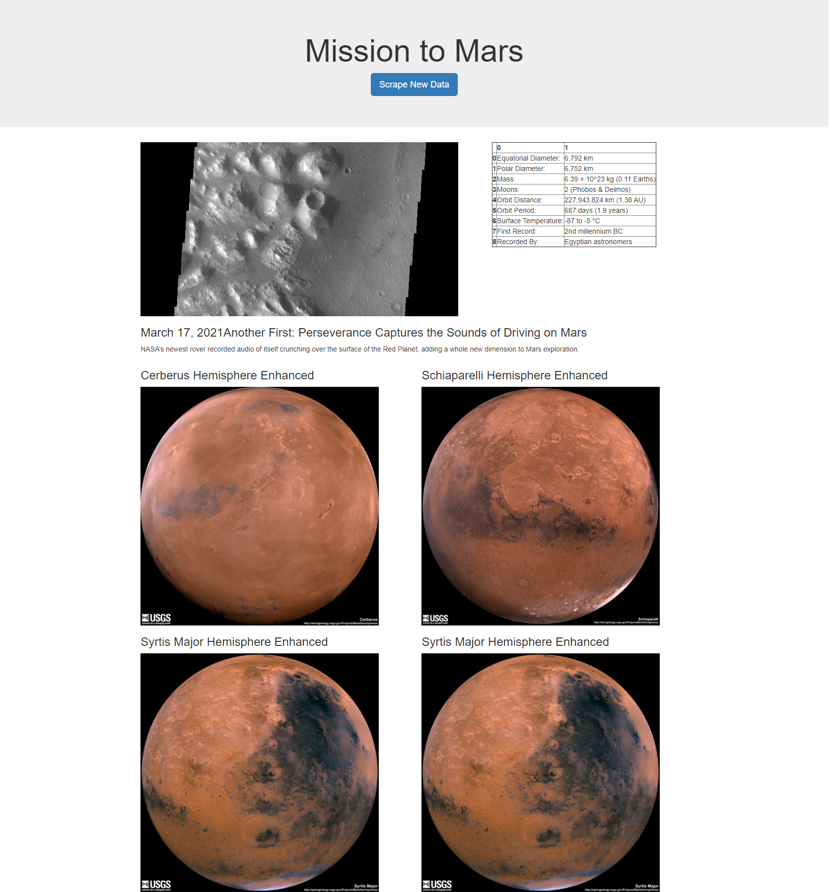
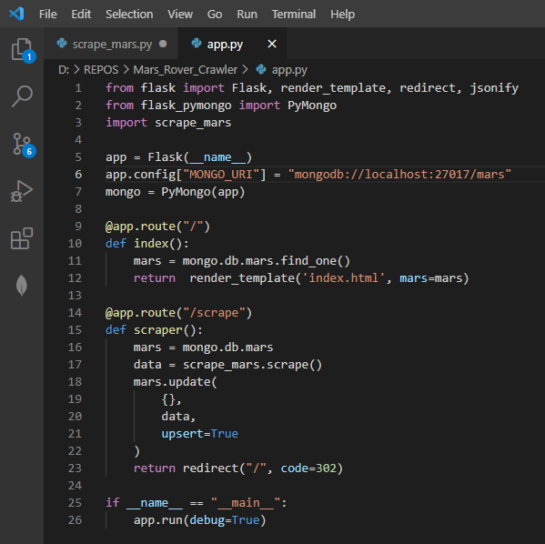
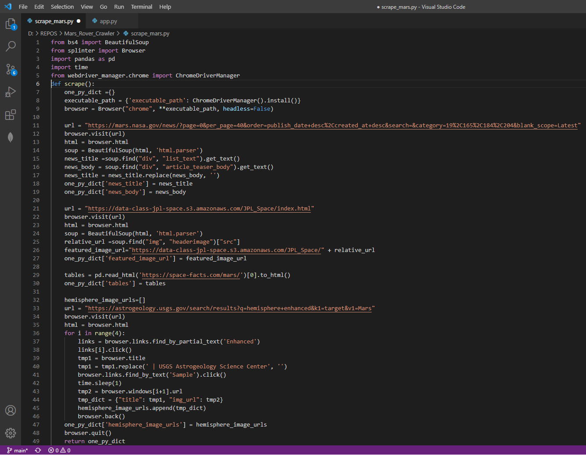

# Web Scraping - Mission to Mars
## Submission

Create a new GitHub repository and upload the following:

1. The Jupyter Notebook containing the scraping code used.

2. Screenshots of your final application.

3. Submit the link to your new repository to BootCampSpot.
4. Ensure your repository has regular commits (i.e. 20+ commits) and a thorough README.md file
